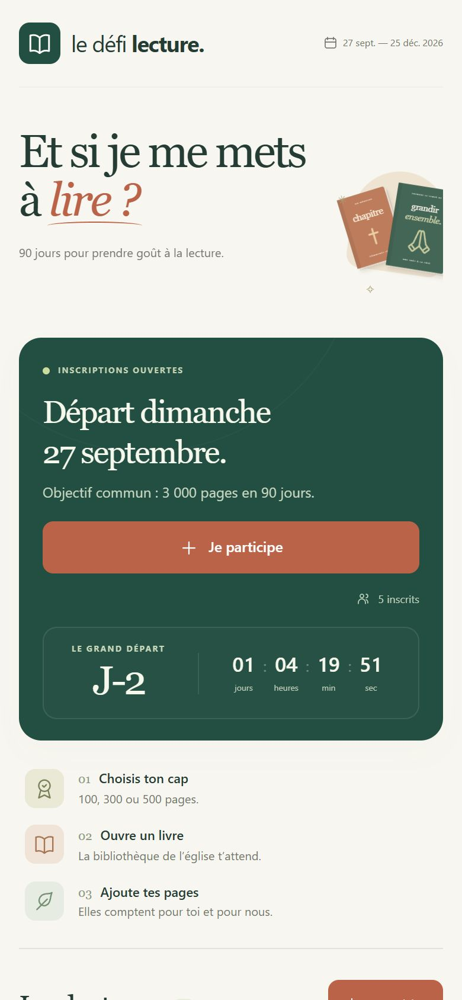
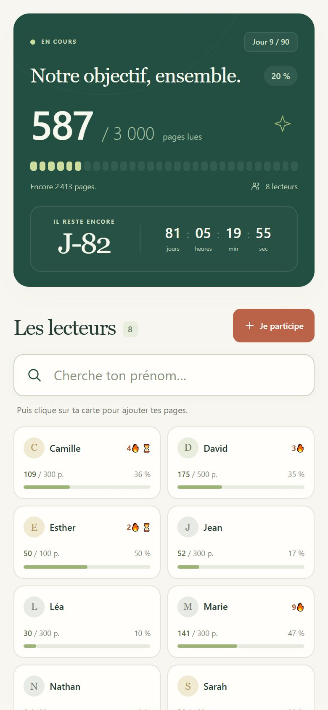
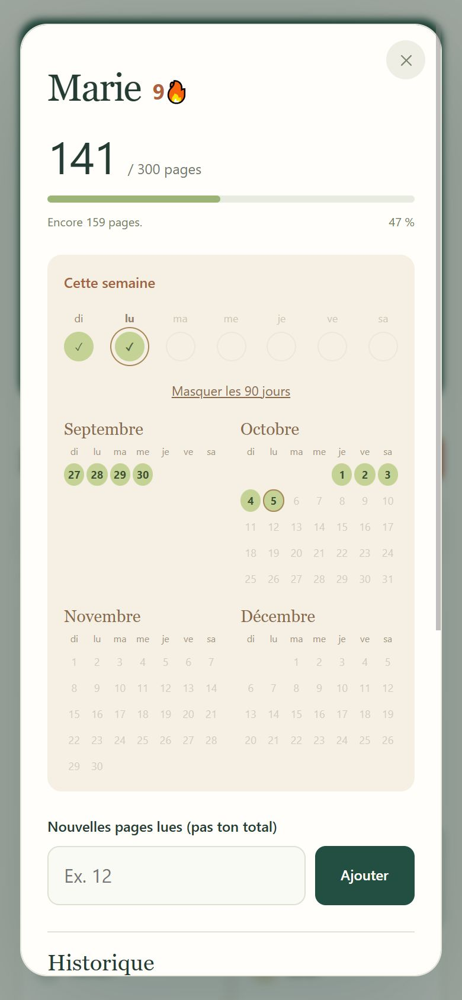
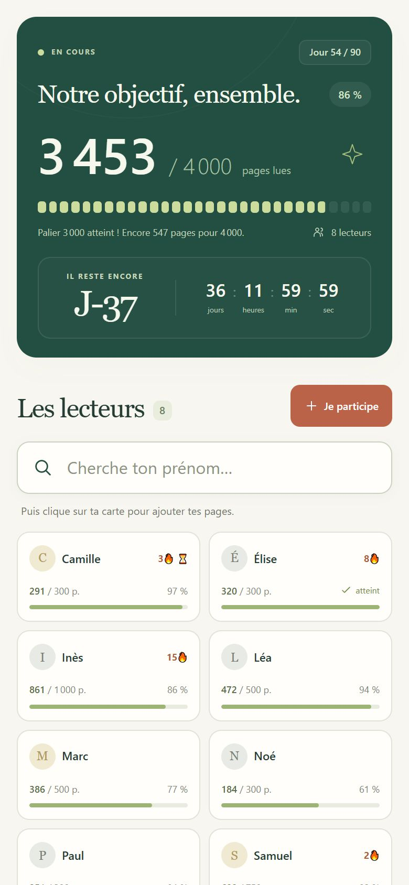
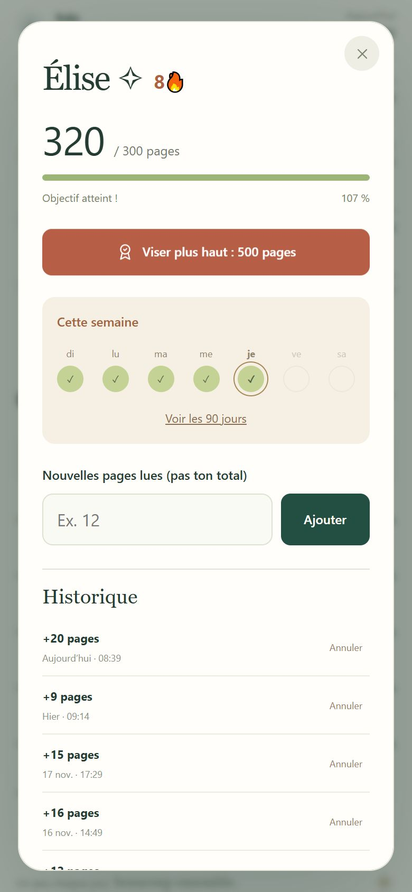
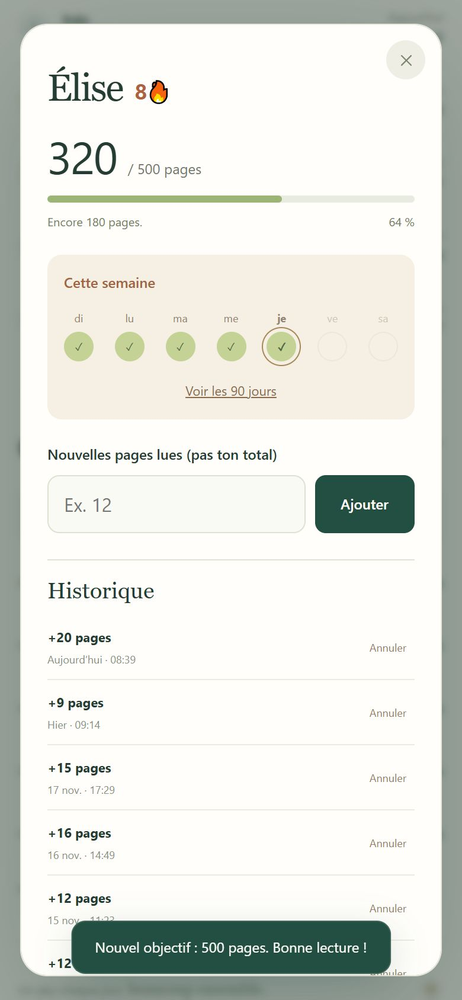

# Le défi lecture

Le défi lecture de l'église : **90 jours** (27 septembre → 25 décembre 2026), **3 000 pages** à lire ensemble,
chacun à son rythme. En ligne : **https://defi-lecture.vercel.app**

|                                  Avant le départ                                   |                                       Pendant le défi                                       |                                       Profil d'un lecteur                                        |
| :--------------------------------------------------------------------------------: | :-----------------------------------------------------------------------------------------: | :----------------------------------------------------------------------------------------------: |
|  |  |  |

**Aller plus loin**

|                                              Palier 3 000 atteint                                               |                                                         Viser plus haut                                                          |                                                              Nouvel objectif                                                              |
| :-------------------------------------------------------------------------------------------------------------: | :------------------------------------------------------------------------------------------------------------------------------: | :---------------------------------------------------------------------------------------------------------------------------------------: |
|  |  |  |

<sub>Captures faites avec des prénoms fictifs.</sub>

## Ce que fait le site

- **Inscription** avec un prénom et un objectif (100, 300 ou 500 pages), sans compte ni mot de passe.
- **Ajout des pages lues** à partir du 27 septembre ; chaque ajout peut être annulé depuis l'historique.
- **Compteur commun** des 3 000 pages. Dès le premier jour, la page d'accueil s'efface d'elle-même pour laisser
  le compteur et les lecteurs en haut. Une fois les 3 000 pages lues, il vise le millier suivant (4 000, puis
  5 000…).
- **Viser plus haut** : quand un lecteur atteint son objectif, un bouton dans son profil lui propose le palier
  suivant (300, 500, 750, 1 000, puis tous les 500).
- **Séries 🔥** : jours de lecture d'affilée. La série casse à minuit à la fin du jour qui suit la dernière lecture ;
  le sablier ⏳ apparaît 18 h après la dernière lecture.
- **Calendrier des 90 jours** dans chaque profil, et classements (pages, séries, objectif). Le classement
  « Objectif » se calcule sur l'objectif de départ : viser plus haut ne fait jamais reculer.
- **Installable sur l'écran d'accueil** du téléphone, comme une app ; on l'actualise en tirant la page vers le bas.

## Organisation du code

```
public/
  index.html        la page
  style.css         la mise en forme
  app.js            le fonctionnement de la page
  domain.js         les règles communes à la page et au serveur (dates, séries, vérifications)
  sw.js, manifest.webmanifest, *.png   l'app sur l'écran d'accueil
api/                les fonctions serveur Vercel : state, profile, participants, entries
lib/db.js           l'accès à la base de données
test/               les tests (sans base de données, date simulée)
scripts/            outil pour redessiner les icônes
docs/               les captures de ce README
```

Aucune dépendance à installer : Node 22 suffit.

## Travailler sur le site

1. Crée une branche et pousse-la : Vercel publie un **lien d'aperçu** de ta branche (pour l'instant, seul le
   propriétaire du projet Vercel peut l'ouvrir). Les aperçus ont leur **propre espace de données** : on y teste sans
   toucher aux vrais lecteurs.
2. Ouvre une pull request. Une fois fusionnée dans `main`, le site en ligne se met à jour tout seul (environ 30 s).
3. Avant de pousser :

   ```
   npm test                       # tests du serveur et des séries
   npx prettier@3 --write .       # mise en forme du code
   ```

## Données

Les inscrits et leurs pages sont dans une base **Upstash Redis** branchée par Vercel. Les clés d'accès restent dans
les réglages Vercel : ne jamais ajouter de fichier `.env` au dépôt.

<sub>Icône des mains jointes : [Phosphor Icons](https://phosphoricons.com) (« hands-praying »), licence MIT.</sub>
