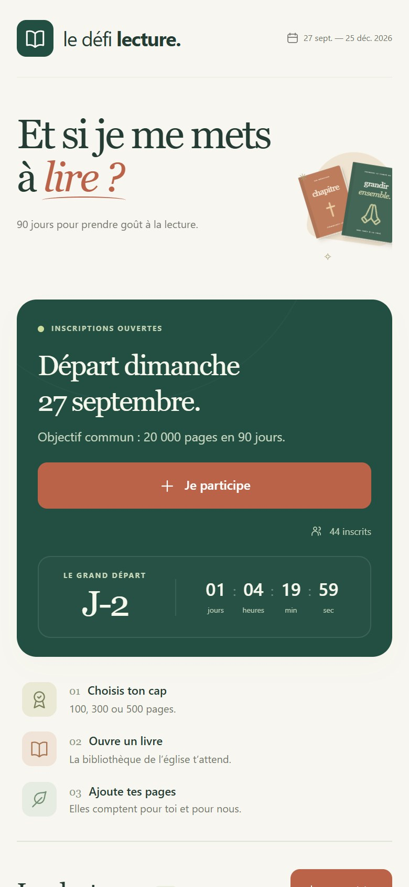
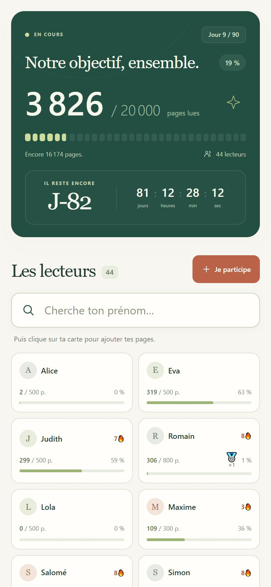
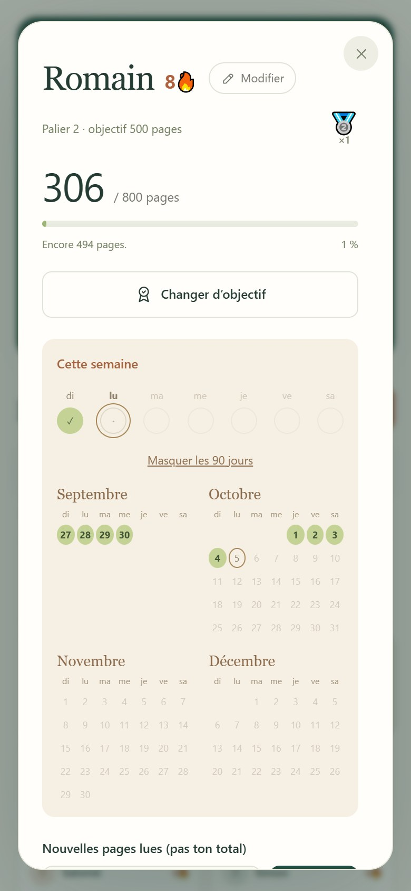
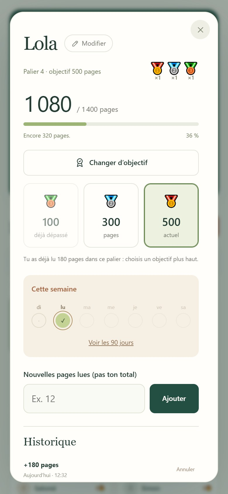
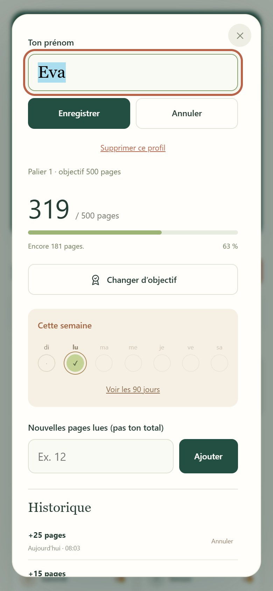
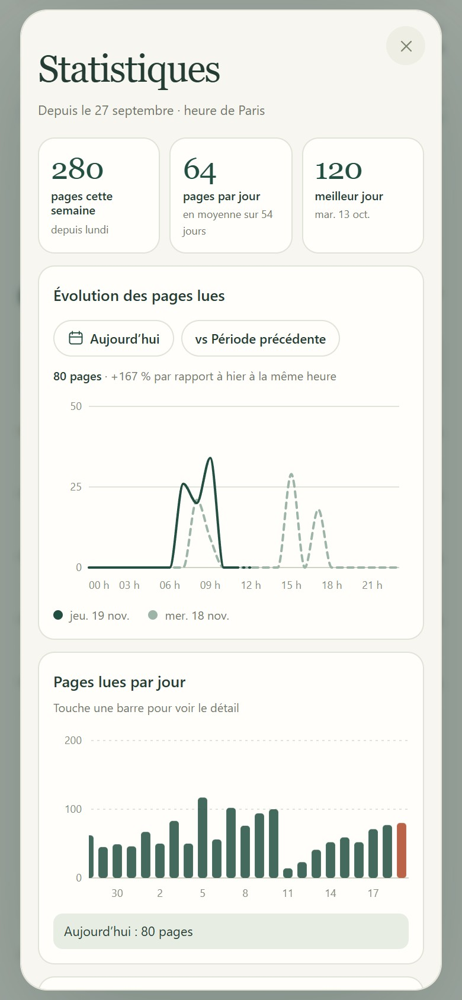
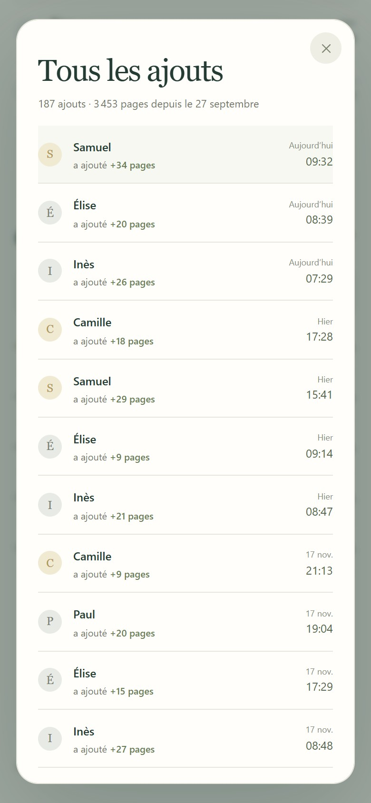
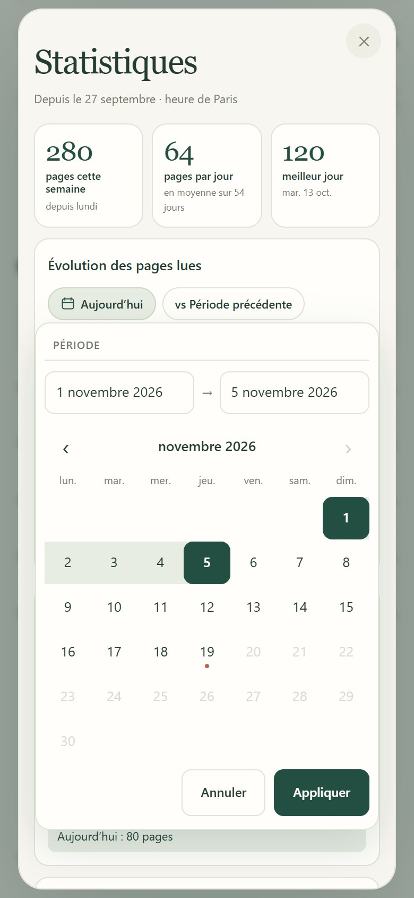

# Le défi lecture

Le défi lecture de l'église : **90 jours** (27 septembre → 25 décembre 2026), **20 000 pages** à lire ensemble,
chacun à son rythme. En ligne : **https://defi-lecture.vercel.app**

|                                  Avant le départ                                   |                                                  Compteur de 20 000 pages                                                  |                                                   Profil d'un lecteur                                                    |
| :--------------------------------------------------------------------------------: | :------------------------------------------------------------------------------------------------------------------------: | :----------------------------------------------------------------------------------------------------------------------: |
|  |  |  |

**Médailles et objectifs**

|                                                                       Médailles et « Changer d'objectif »                                                                       |
| :-----------------------------------------------------------------------------------------------------------------------------------------------------------------------------: |
|  |

**Son profil**

|                                                             Modifier ou supprimer son profil                                                              |
| :-------------------------------------------------------------------------------------------------------------------------------------------------------: |
|  |

**Statistiques**

|                                                                        Statistiques                                                                         |                                                 Tous les ajouts                                                  |                                                Choisir les dates                                                 |
| :---------------------------------------------------------------------------------------------------------------------------------------------------------: | :--------------------------------------------------------------------------------------------------------------: | :--------------------------------------------------------------------------------------------------------------: |
|  |  |  |

<sub>Captures faites avec des prénoms fictifs.</sub>

## Ce que fait le site

- **Inscription** avec un prénom et un objectif (100, 300 ou 500 pages), sans compte ni mot de passe.
- **Liste des lecteurs** triée par activité la plus récente (qui vient d'ajouter des pages en premier ; avant le
  départ, les inscriptions les plus récentes en premier).
- **Ajout des pages lues** à partir du 27 septembre ; chaque ajout peut être annulé depuis l'historique.
- **Compteur commun** des 20 000 pages. Dès le premier jour, la page d'accueil s'efface d'elle-même pour laisser
  le compteur et les lecteurs en haut. Une fois les 20 000 pages lues, il vise le millier suivant (21 000, puis
  22 000…).
- **Paliers et médailles** : chaque palier rempli jusqu'à l'objectif rapporte sa médaille (🥉 100, 🥈 300, 🥇 500
  pages) ; le surplus passe dans le palier suivant, qui garde le même objectif. « Changer d'objectif » dans le profil
  permet de passer à 100, 300 ou 500 pages à tout moment, sauf à un objectif déjà dépassé dans le palier en cours.
- **Séries 🔥** : jours de lecture d'affilée. La série casse à minuit à la fin du jour qui suit la dernière lecture ;
  le sablier ⏳ apparaît 18 h après la dernière lecture.
- **Profil modifiable** : chacun peut corriger son prénom ou supprimer son profil, après une confirmation.
- **Statistiques** : courbe des pages lues avec période et comparaison au choix, pages par jour, lecteurs actifs,
  heures de lecture ; « Voir tout » liste tous les ajouts.
- **Calendrier des 90 jours** dans chaque profil, et classements (pages, séries, objectif). Le classement
  « Objectif » compte les médailles (l'or d'abord, puis l'argent, puis le bronze), puis l'avancée du palier en cours.
- **Installable sur l'écran d'accueil** du téléphone, comme une app ; on l'actualise en tirant la page vers le bas.

## Organisation du code

```
public/
  index.html        la page
  style.css         la mise en forme
  app.js            le fonctionnement de la page
  domain.js         les règles communes à la page et au serveur (dates, séries, vérifications)
  sw.js, manifest.webmanifest, *.png   l'app sur l'écran d'accueil
api/                les fonctions serveur Vercel : state, profile, participants, entries
lib/db.js           l'accès à la base de données
test/               les tests (sans base de données, date simulée)
scripts/            outil pour redessiner les icônes
docs/               les captures de ce README
```

Aucune dépendance à installer : Node 22 suffit.

## Travailler sur le site

1. Crée une branche et pousse-la : Vercel publie un **lien d'aperçu** de ta branche (pour l'instant, seul le
   propriétaire du projet Vercel peut l'ouvrir). Les aperçus ont leur **propre espace de données** : on y teste sans
   toucher aux vrais lecteurs.
2. Ouvre une pull request. Une fois fusionnée dans `main`, le site en ligne se met à jour tout seul (environ 30 s).
3. Avant de pousser :

   ```
   npm test                       # tests du serveur et des séries
   npx prettier@3 --write .       # mise en forme du code
   ```

## Données

Les inscrits et leurs pages sont dans une base **Upstash Redis** branchée par Vercel. Les clés d'accès restent dans
les réglages Vercel : ne jamais ajouter de fichier `.env` au dépôt. Un profil supprimé est seulement mis de côté dans
la base, avec ses pages : il peut être restauré.

<sub>Icône des mains jointes : [Phosphor Icons](https://phosphoricons.com) (« hands-praying »), licence MIT.</sub>
